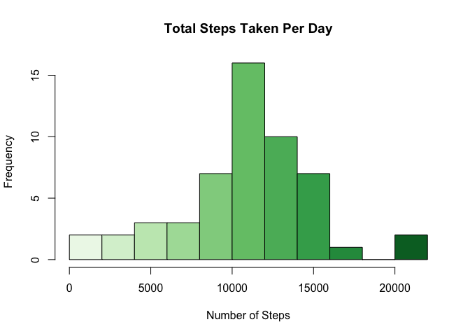
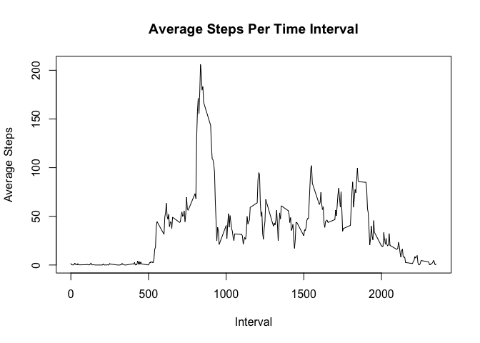
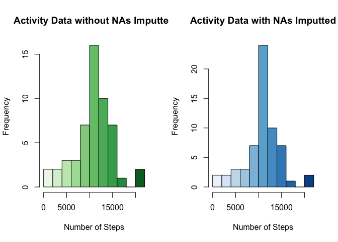
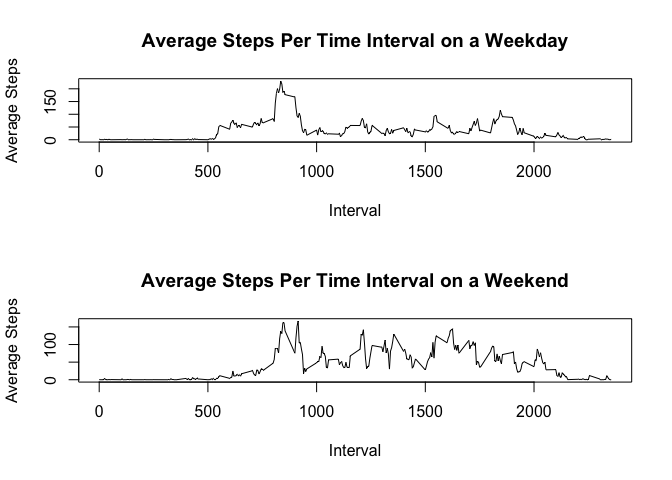

## Loading and preprocessing the data
Make sure the dataset is in your working directory before reading in the file


```r
dataset <- read.csv("activity.csv")
library(ggplot2)
library(RColorBrewer)
```


## What is mean total number of steps taken per day?
### To calculate total number of steps per day

```r
totalstepsperday <- tapply(dataset$steps, dataset$date, sum)
as.data.frame(totalstepsperday)
```

```
##            totalstepsperday
## 2012-10-01               NA
## 2012-10-02              126
## 2012-10-03            11352
## 2012-10-04            12116
## 2012-10-05            13294
## 2012-10-06            15420
## 2012-10-07            11015
## 2012-10-08               NA
## 2012-10-09            12811
## 2012-10-10             9900
## 2012-10-11            10304
## 2012-10-12            17382
## 2012-10-13            12426
## 2012-10-14            15098
## 2012-10-15            10139
## 2012-10-16            15084
## 2012-10-17            13452
## 2012-10-18            10056
## 2012-10-19            11829
## 2012-10-20            10395
## 2012-10-21             8821
## 2012-10-22            13460
## 2012-10-23             8918
## 2012-10-24             8355
## 2012-10-25             2492
## 2012-10-26             6778
## 2012-10-27            10119
## 2012-10-28            11458
## 2012-10-29             5018
## 2012-10-30             9819
## 2012-10-31            15414
## 2012-11-01               NA
## 2012-11-02            10600
## 2012-11-03            10571
## 2012-11-04               NA
## 2012-11-05            10439
## 2012-11-06             8334
## 2012-11-07            12883
## 2012-11-08             3219
## 2012-11-09               NA
## 2012-11-10               NA
## 2012-11-11            12608
## 2012-11-12            10765
## 2012-11-13             7336
## 2012-11-14               NA
## 2012-11-15               41
## 2012-11-16             5441
## 2012-11-17            14339
## 2012-11-18            15110
## 2012-11-19             8841
## 2012-11-20             4472
## 2012-11-21            12787
## 2012-11-22            20427
## 2012-11-23            21194
## 2012-11-24            14478
## 2012-11-25            11834
## 2012-11-26            11162
## 2012-11-27            13646
## 2012-11-28            10183
## 2012-11-29             7047
## 2012-11-30               NA
```

### Histogram for total number of steps per day

```r
hist(totalstepsperday, breaks = 10, xlab = "Number of Steps", ylab = "Frequency", main = "Total Steps Taken Per Day", col = colorRampPalette(brewer.pal(5, "Greens"))(11))
```

<!-- -->

### To calculate mean and median number of steps per day

```r
meansteps <- mean(totalstepsperday, na.rm = TRUE)
meansteps
```

```
## [1] 10766.19
```

```r
mediansteps <- median(totalstepsperday, na.rm = TRUE)
mediansteps
```

```
## [1] 10765
```

## What is the average daily activity pattern?
### To plot average number of steps for each time interval across all days
Need to make dataset$interval into a factor in order to tapply across those groups.
Removed all NA values prior to tapply.

```r
dataset$interval <- as.factor(dataset$interval)
cleandata <- dataset[!is.na(dataset$steps), ]
avgstepsperday <- tapply(cleandata$steps, cleandata$interval, mean)
plot(as.numeric(names(avgstepsperday)), avgstepsperday, type = "l", xlab = "Interval", ylab = "Average Steps", main = "Average Steps Per Time Interval")
```

<!-- -->

### Which 5-min interval contains the maximum number of steps on average?
maxavgsteps gives the max of the interval and maxavgstepsinterval gives the interval in which that max occurs (second number (104) in maxavgstepsinterval gives the factor number the 835 interval is at).

```r
maxavgsteps <- max(avgstepsperday)
maxavgsteps
```

```
## [1] 206.1698
```

```r
maxavgstepsinterval <- which.max(avgstepsperday)
maxavgstepsinterval
```

```
## 835 
## 104
```

## Imputing missing values
### Calculate total number of missing values

```r
sum(is.na(dataset))
```

```
## [1] 2304
```

### Fill in the missing values into the dataset; filled in by average of the 5-min interval
Checked that there were no more NAs at the end if the for loop.

```r
datasetsplit <- split(dataset, dataset$interval)
for(i in 1:length(datasetsplit)) {
  datasetsplit[[i]]$steps[is.na(datasetsplit[[i]]$steps)] <- avgstepsperday[i]
}
filledindata <- do.call("rbind", datasetsplit)
sum(is.na(filledindata))
```

```
## [1] 0
```

### Histogram of total number of steps per day with NA values filled in

```r
par(mfrow = c(1,2))
newtotalstepsperday <- tapply(filledindata$steps, filledindata$date, sum)
hist(totalstepsperday, breaks = 10, xlab = "Number of Steps", ylab = "Frequency", main = "Activity Data without NAs Imputted", col = colorRampPalette(brewer.pal(5, "Greens"))(11))
hist(newtotalstepsperday, breaks = 10, xlab = "Number of Steps", ylab = "Frequency", main = "Activity Data with NAs Imputted", col = colorRampPalette(brewer.pal(5, "Blues"))(11))
```

<!-- -->

### To calculate new mean and median total number of steps per day

```r
newmeansteps <- mean(newtotalstepsperday, na.rm = TRUE)
newmeansteps
```

```
## [1] 10766.19
```

```r
newmediansteps <- median(newtotalstepsperday, na.rm = TRUE)
newmediansteps
```

```
## [1] 10766.19
```

## Are there differences in activity patterns between weekdays and weekends?
### Create a new factor in the dataset for weekday vs. weekend

```r
filledindata$date <- as.Date(filledindata$date)
for(i in 1:nrow(filledindata)) {
  if (weekdays(filledindata$date[i]) == "Saturday" | weekdays(filledindata$date[i]) == "Sunday") {
    filledindata$weekday[i] = "weekend"
  }
  else {
    filledindata$weekday[i] = "weekday"
   }            
}
```

### Time series plot of average number of steps taken in 5-minute interval based on weekday vs. weekend

```r
dataWeekday <- subset(filledindata, filledindata$weekday == "weekday")
dataWeekend <- subset(filledindata, filledindata$weekday == "weekend")
avgstepsperweekday <- tapply(dataWeekday$steps, dataWeekday$interval, mean)
avgstepsperweekend <- tapply(dataWeekend$steps, dataWeekend$interval, mean)
par(mfrow = c(2,1))
plot(as.numeric(names(avgstepsperweekday)), avgstepsperweekday, type = "l", xlab = "Interval", ylab = "Average Steps", main = "Average Steps Per Time Interval on a Weekday")
plot(as.numeric(names(avgstepsperweekend)), avgstepsperweekend, type = "l", xlab = "Interval", ylab = "Average Steps", main = "Average Steps Per Time Interval on a Weekend")
```

<!-- -->
